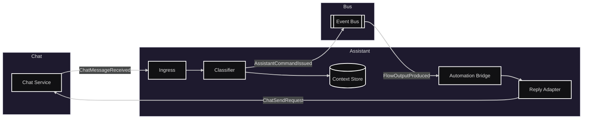

# Módulo: Asistente

## Diagrama arquitectura

```mermaid
---
config:
  look: classic
  theme: redux-dark-color
---
flowchart LR
  subgraph Chat
    CHAT[Chat Service]
  end

  subgraph Assistant
    IN[Ingress]
    CLF[Classifier]
    CTX[(Context Store)]
    BR[Automation Bridge]
    RPY[Reply Adapter]
  end

  subgraph Bus
    EV[[Event Bus]]
  end

  CHAT -- ChatMessageReceived --> IN
  IN --> CLF
  CLF --> CTX
  CLF -- AssistantCommandIssued --> EV
  EV -- FlowOutputProduced --> BR
  BR --> RPY
  RPY -- ChatSendRequest --> CHAT
```

---

## Requerimientos

---

## Listado de puntos de comunicación
