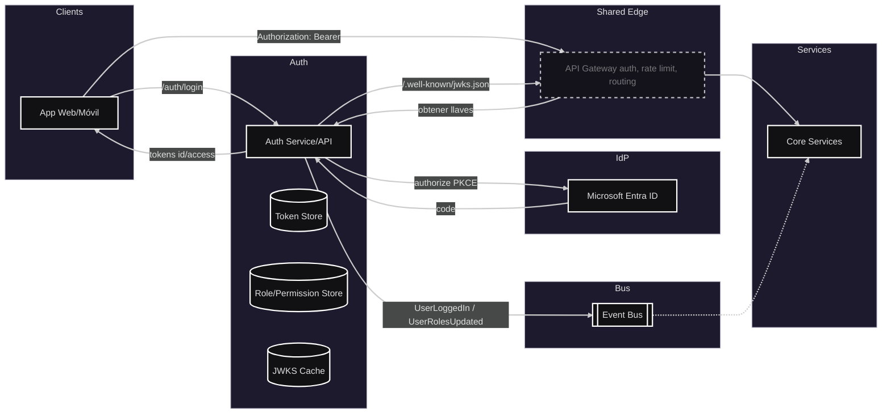

# Módulo: Autenticación de usuario

## Diagrama arquitectura

---

## Requerimientos

- Login institucional con Microsoft (Entra ID) vía OIDC.
- Emisión de JWT firmados (RS256/ES256).
- Exposición de JWKS en `/.well-known/jwks.json` para validación por gateway y servicios.
- Gestión de roles/permisos (RBAC) y publicación de cambios de roles.
- Opcional: Refresh tokens, rotación de claves y logout único (SSO).

---

## Permisos de usuario (RBAC)

- Roles ejemplo: `estudiante`, `profesor`, `administrativo`, `moderador`, `admin`.
- Scopes por capacidad: `discovery.read`, `discovery.write`, `calendar.read`, `calendar.write`, `chat.write`, `admin.*`.
- Autorización por `roles[]/scopes[]` en gateway/servicios; principio de mínimo privilegio.
- Delegación: operadores autorizados pueden asignar/revocar roles; cambios se auditan.

---

## Listado de puntos de comunicación

### Sincrónicos (HTTP/OIDC)

- Iniciar login (Redirect OIDC): `GET /auth/login`
- Callback OIDC (Request/Response): `GET /auth/callback?code=...`
- Cerrar sesión (Redirect + invalidación): `GET /auth/logout`
- Renovar token (Request/Response): `POST /auth/refresh`
- JWKS público (Key Discovery): `GET /.well-known/jwks.json`
- Datos del usuario actual (Request/Response): `GET /me`
- Asignar rol (Request/Response): `POST /roles/assign`
- Revocar rol (Request/Response): `POST /roles/revoke`
- Introspección (si tokens opacos) (Request/Response): `POST /oauth/introspect`

### Asincrónicos (Eventos Pub/Sub)

- `UserLoggedIn` — auditoría de ingreso.
- `UserLoggedOut` — cierre de sesión.
- `UserCreated` / `UserUpdated` — sincronización de perfil.
- `UserRolesUpdated` — cambios de autorización.
- `SessionRevoked` — invalidación proactiva.

### Suscriptores

- API Gateway: cachea JWKS y valida firmas de JWT.

