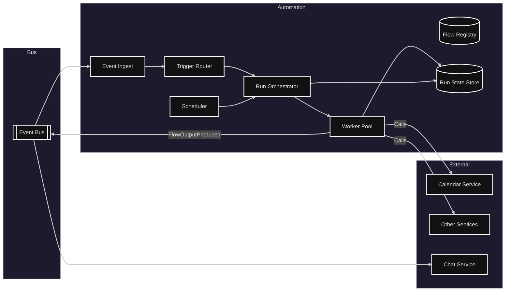
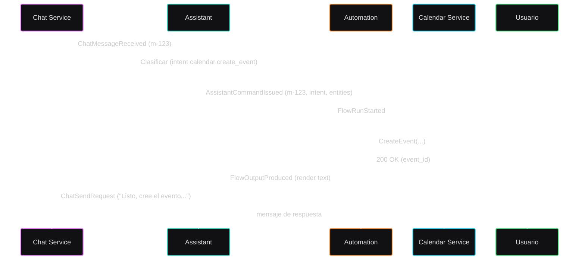

# Módulo: Automatización

## Diagrama arquitectura

---

## Requerimientos

---

## Secuencia típica (mensaje → evento de calendario → respuesta)

---

## Listado de puntos de comunicación

### Eventos (Pub/Sub)

- Disparar flujos por intención del asistente: Evento AssistantCommandIssued (del - Asistente) — trigger cuando `assistant.intent == ...`
- Ejecutar trabajos programados: Cron en Scheduler (interno)
