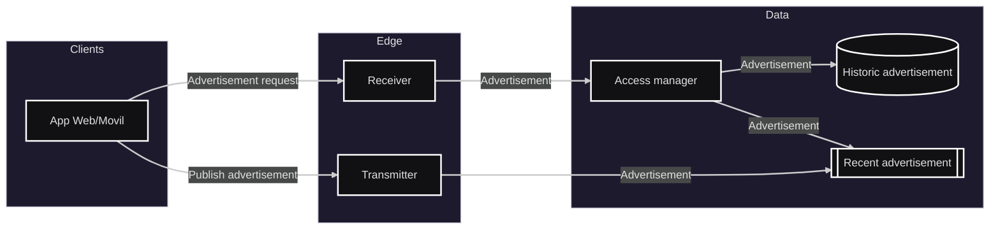

# Módulo: Chat

## Diagrama arquitectura

>_Se tendran dos puntos de almacenamiento, uno donde de guardaran todos los avisos historicos, mientras que otro punto con mayor volatilidad gestionara unicamente los mas recienmtes (usando colas se minimizara el tiempo de consulta)._
---

## Requerimientos

- Generar mensajes para difusión masiva.
- El emisor puede seleccionar los receptores del mensaje, segmentados según grupo (por ejemplo carrera).
- El emisor puede editar o eliminar el aviso subido al sistema.
- El receptor debe ser capaz de consultar los avisos anteriores.
- El receptor debe ser capaz de enviar al flujo del asistente algún aviso que desee. 

---

## Listado de puntos de comunicación

### Eventos (Pub/Sub)

- Ver último aviso: `WarningQueue` 
- Enviar aviso al flujo del asistente: `AssistantQueue`

### HTTP/RPC (sincrónico)

- Subir aviso para una cantidad definida de estudiantes: `POST /warning/{gmail}/{mensaje}/{receptores}`
	>gmail: Correo institucional del emisor del aviso. 
	mensaje: Texto a enviar como aviso. 
	receptores: Lista de receptores del aviso.
- Editar aviso: `PUT /warning/{id}/{mensaje}`
	>id: Identificador único del aviso.
	mensaje: Nuevo texto para modificar el archivo.
- Eliminar aviso: `DELETE /warning/{id}`
	>id: Identificador único del aviso.
- Ver avisos historicos del usuario: `GET /warning/{gmail}`
	>gmail: Correo institucional del receptor del aviso.

