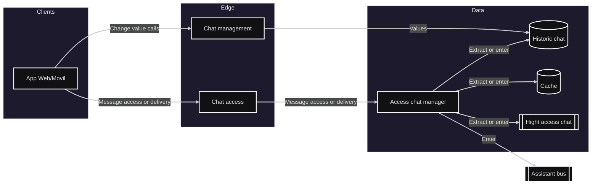

# Módulo: Asistente

## Diagrama arquitectura

---

## Requerimientos

- Registrar nuevo chat y eliminarlo cuando se estime necesario.
- Agregar manualmente a estudiantes al chat, así como también eliminarlos. En caso de ser un usuario autorizado para esto.
- Unirse o solicitar unirse a canales de difusión públicos o privados.
- Enviar mensajes al chat que el integrante desee.
- Ver mensajes históricos del chat que se consulte.
- Generar mensajes persistentes dentro del chat con el fin de mostrarlo de forma constante (en caso de tener permisos para ello). Así como también eliminarlos si fuera necesario.
- Editar descripción del chat.
- Enviar un mensaje puntual del chat hacia el módulo de asistente.

---

## Listado de puntos de comunicación

### Eventos (Pub/Sub)

- Enviar mensaje del chat al módulo de asistente: `AssistantQueue`
- revisar mensajes del chat (cola por cada grupo/chat): `ChatQueue_{id}` 

### HTTP/RPC (sincrónico)

- Registrar nuevo chat (puede ser de tipo autorizado o no): `GET /chat/new/{nombre}/{tipo}/{privacidad}/{autorización}`
	>nombre:Nombre del chat. 
	tipo: Puede ser canal de difusión o comunidad. 
	privacidad: Puede ser con acceso público o privado. 
	autorización: Si el usuario que creó dicho grupo está autorizado o no.
- Eliminar chat: `DELETE /chat/{id}`
	>id: Identificador único del chat a eliminar.
- Agregar Integrante al chat (en caso de ser autorizado): `POST /chat/{id}/member/{gmail}`
	>id: Identificador único del chat. 
	gmail: Correo institucional del usuario a agregar.
- Solicitar unirse a un determinado chat: `POST /chat/{id}/member/pending/{gmail}`
	>id: Identificador único del chat. 
	gmail: Correo institucional del usuario solicitante.
- 	Eliminar a estudiante de un chat: `DELETE /chat/{id}/member/{gmail}`
	>id: Identificador único del chat. 
	gmail: Correo institucional del usuario.
- 	Enviar mensaje a un chat determinado: `POST /chat/{id}/message/{gmail}/{mensaje}`
	>id: Identificador único del chat. 
	gmail: Correo institucional del usuario. 
	mensaje: Texto a enviar por el chat.
- Consultar si hay elementos en la cola del chat (mensajes nuevos sin cargar todo): `GET /chat/{id}/message/{gmail}/{hora}`
	>id: Identificador único del chat. 
	gmail: Correo institucional del usuario. 
	hora: Fecha y hora de la última descarga de mensajes.
- Crear mensajes persistentes en el chat: `POST /chat/{id}/persistent/{gmail}/{mensaje}`
	>id: Identificador único del chat. 
	gmail: Correo institucional del usuario. 
	mensaje: Texto a enviar por el chat.
- Eliminar mensajes persistentes del chat: `DELETE /chat/{id}/persistent/{gmail}/{mensaje}`
	>id: Identificador único del chat. 
	gmail: Correo institucional del usuario. 
	mensaje: Texto a eliminar.
- Modificar descripción del chat: `PUT /chat/{id}/description/{texto}`
	>texto: Nuevo texto para introducir en la descripción.
