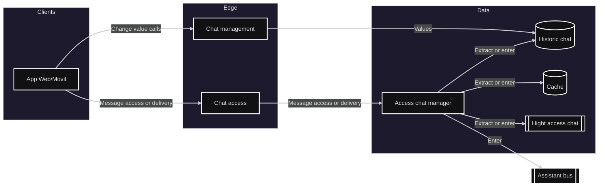

# Módulo: Asistente

## Diagrama arquitectura

---

## Requerimientos

-Registrar nuevo chat y eliminarlo cuando se estime necesario.
-Agregar manualmente a estudiantes al chat, así como también eliminarlos. En caso de ser un usuario autorizado para esto.
-Unirse o solicitar unirse a canales de difusión públicos o privados.
-Enviar mensajes al chat que el integrante desee.
-Ver mensajes históricos del chat que se consulte.
-Generar mensajes persistentes dentro del chat con el fin de mostrarlo de forma constante (en caso de tener permisos para ello). Así como también eliminarlos si fuera necesario.
-Editar descripción del chat.
-Enviar un mensaje puntual del chat hacia el módulo de asistente.

---

## Listado de puntos de comunicación

### Eventos (Pub/Sub)

- Enviar mensaje del chat al módulo de asistente: `AssistantQueue`
