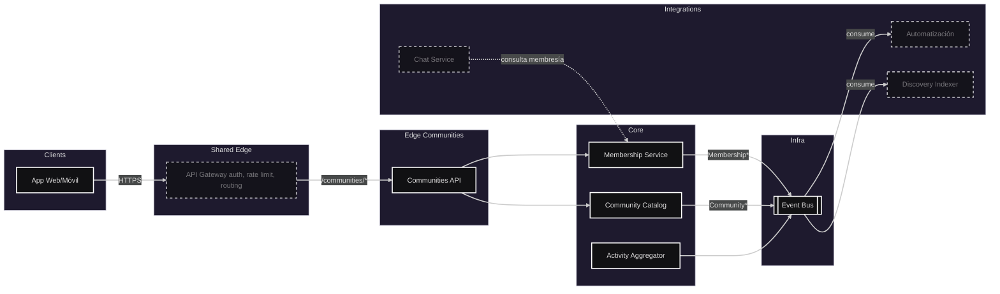
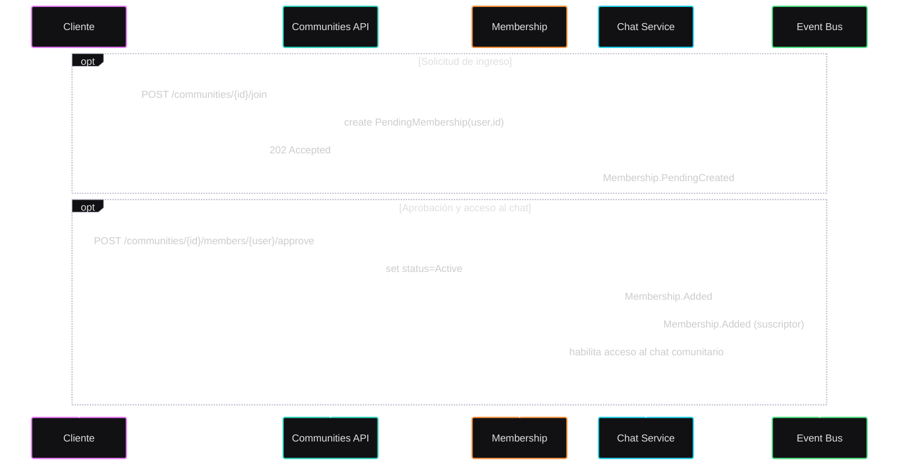
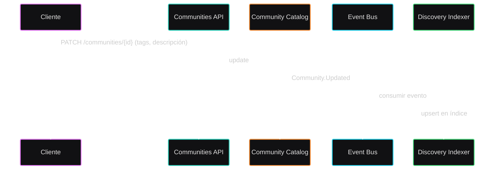

# Módulo: Comunidades

## Diagrama arquitectura

---

## Requerimientos

- Gestionar el ciclo de vida de comunidades: crear, actualizar, archivar/eliminar, verificación y visibilidad (pública/privada/oficial).
- Modelo de membresía con roles: owner, moderador, miembro; solicitudes de ingreso, aprobación/rechazo, expulsión, abandono.
- Políticas de acceso por campus/carrera/rol institucional; soporte a comunidades oficiales y temáticas.
- Actividad: agregar y consolidar señales de actividad (mensajes, publicaciones, crecimiento de miembros) para ranking/descubrimiento.
- Emitir eventos de dominio para mantener actualizado el índice de Discovery y sincronizar accesos de Chat.
- Auditoría básica: quién creó/archivó/aceptó solicitudes; timestamps e IP opcional.
- Integrarse con Auth para autorización RBAC y claims de usuario (campus/carrera/roles).

---

## Diagramas de flujo

### Solicitud de ingreso y acceso al Chat

### Actualización de metadatos y reindexación

---

## Listado de puntos de comunicación

### Sincrónicos (HTTP/RPC)

#### Communities API
- Crear comunidad: `POST /communities`
- Actualizar parcialmente comunidad: `PATCH /communities/{id}`
- Archivar/Eliminar comunidad: `DELETE /communities/{id}`
- Obtener detalles: `GET /communities/{id}`
- Listar mis comunidades: `GET /me/communities`

#### Membership
- Solicitar unirse: `POST /communities/{id}/join`
- Aprobar solicitud: `POST /communities/{id}/members/{userId}/approve`
- Rechazar solicitud: `POST /communities/{id}/members/{userId}/reject`
- Expulsar miembro: `DELETE /communities/{id}/members/{userId}`
- Abandonar comunidad: `DELETE /communities/{id}/members/me`
- Obtener conteo de miembros: `GET /communities/{id}/members/count`

### Asincrónicos (Eventos Pub/Sub)

- `Community.Created`, `Community.Updated`, `Community.Archived`
- `Membership.Added`, `Membership.Removed`, `Community.MemberCountUpdated`
- `CommunityActivity.WindowAggregated`

### Suscriptores

- Discovery Indexer: mantiene índice actualizado a partir de `Community*`, `Membership*`, `CommunityActivity.*`.
- Chat Service: aplica accesos/visibilidad según `Membership.*` y `Community.*`.
- Automatización: puede reaccionar a eventos para flujos de bienvenida/moderación.

---

## Notas de seguridad y datos

- Autorización basada en roles y ownership: sólo owners/moderadores pueden moderar y editar; miembros sólo lectura.
- Validación de visibilidad: comunidades privadas no aparecen en Discovery salvo invitación/miembros.
- Minimización de datos personales: ID de usuario y atributos mínimos (campus/carrera) para reglas.

