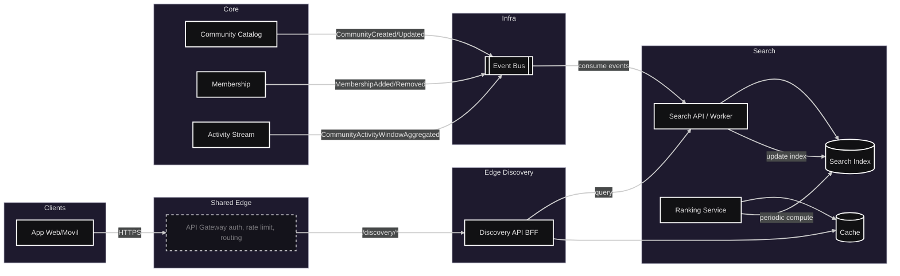
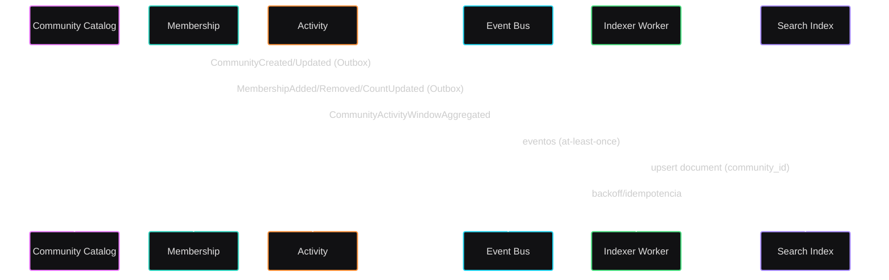
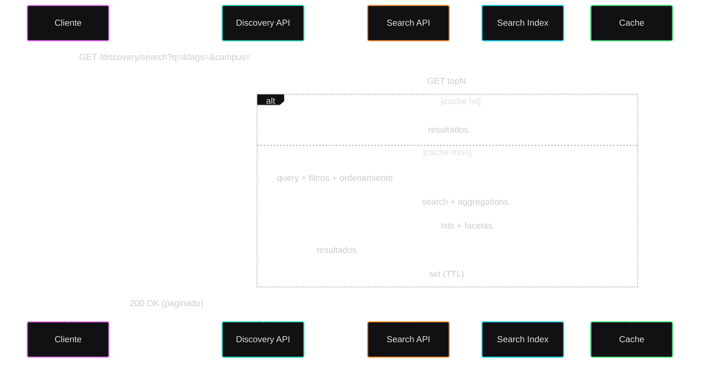

# Módulo: Descubrimiento de comunidades

## Requerimientos

* Buscar comunidades por texto, tags, campus, visibilidad y rango de tamaño.
* Ordenar por actividad reciente, crecimiento de miembros, relevancia semántica y verificación.
* Mostrar facetas (counts por tag/campus/visibilidad).
* Endpoint para “Descubrir para mí”: usa datos del usuario como campus, carrera y tags de interés.
* Auditoría básica de búsquedas (para métricas de producto).

## Diagrama de arquitectura

## Diagrama de flujo de indexación

## Diagrama de flujo de búsqueda

## Listado de puntos de comunicación

### Sincrónicos (HTTP/RPC)

#### Discovery API
- Buscar comunidades con filtros y orden: `GET /discovery/search`
- Obtener facetas (counts por tag/campus/visibilidad): `GET /discovery/facets`

#### Search API
- Ejecutar consulta al índice de búsqueda: `POST /search/query`
- Reindexar manualmente una comunidad: `POST /search/reindex/{community_id}`

#### Community Catalog
- Crear una comunidad: `POST /communities`
- Actualizar parcialmente una comunidad: `PATCH /communities/{id}`
- Obtener detalles de una comunidad: `GET /communities/{id}`

#### Membership
- Agregar miembro a una comunidad: `POST /communities/{id}/members`
- Eliminar miembro de una comunidad: `DELETE /communities/{id}/members/{userId}`
- Obtener conteo de miembros de una comunidad: `GET /communities/{id}/members/count`

### Asincrónicos (Eventos Pub/Sub)

- Notificar creación de comunidad: `Evento Community.Created`
- Notificar actualización de comunidad: `Evento Community.Updated`
- Notificar archivado de comunidad: `Evento Community.Archived`
- Notificar alta de miembro: `Evento Membership.Added`
- Notificar baja de miembro: `Evento Membership.Removed`
- Notificar actualización del conteo de miembros: `Evento Community.MemberCountUpdated`
- Publicar agregación de actividad reciente: `Evento CommunityActivity.WindowAggregated`

### Suscriptores
- Mantener el índice de búsqueda actualizado: `Indexer Worker` a `Community*`, `Membership*`, `CommunityActivity.WindowAggregated`
