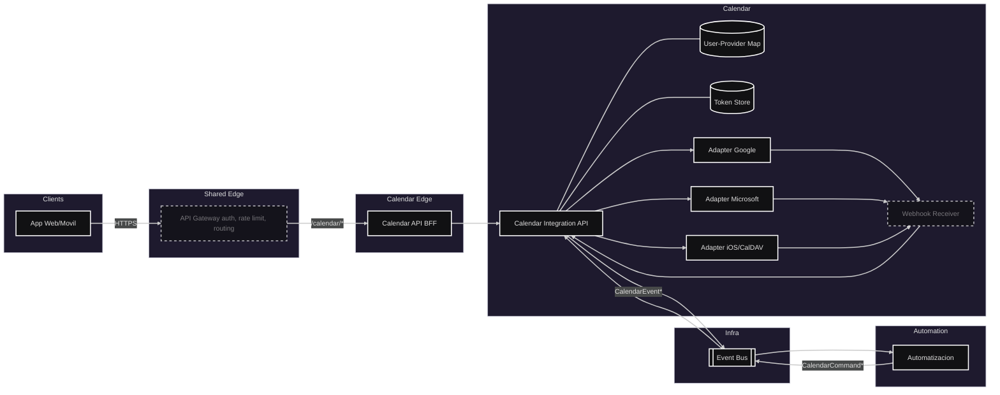

# Módulo: Calendario (Externos)
## Diagrama arquitectura

## Requerimientos

- Vincular cuentas vía OAuth/OIDC (Google, Microsoft, CalDAV); guardar vínculo por usuario/proveedor.
- Crear, actualizar y cancelar eventos por HTTP y vía comandos asíncronos; idempotencia con `Idempotency-Key`.
- Listar/consultar eventos por rango y zona horaria; copia de eventos del calendario académico al personal.
- Integrarse con Asistente/Avisos/Chats/Comunidades.

## Listado de puntos de comunicación

### HTTP (sincrónico)
- Iniciar vínculo con Google/Microsoft/iOS (consent OAuth/OIDC; una vez por usuario/proveedor): `GET /calendar/connect?provider={p}`
- Cerrar OAuth y guardar token del usuario: `GET /calendar/callback`
- Crear evento externo “en nombre del usuario” (idempotente por `Idempotency-Key`): `POST /calendar/events`
- Recibir notificaciones del proveedor (lista conocida de orígenes): `POST /{provider}/webhook`

### Eventos (Pub/Sub)
- Crear evento disparado por flujos del Asistente: Evento `CalendarCommand.ScheduleEvent`
- Confirmación de creación exitosa: Evento `CalendarEvent.Created`
- Notificación de falla al crear: Evento `CalendarEvent.CreateFailed`
