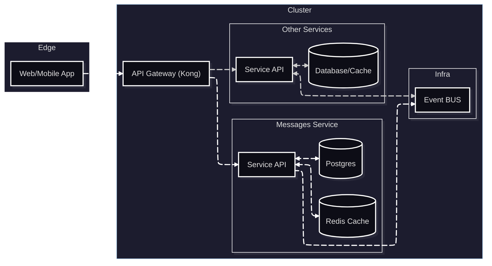

# Proyecto INF326 - Messages Service

Servicio de mensajes para un sistema de chat desarrollado en Fast API y listo para ser desplegado en kubernetes.

### Diagrama del sistema

## Servicio
- Codigo y documentacion en [`service/`](service/) (ver [`service/README.md`](service/README.md) para flujos, API y eventos).
- [`service/docker-compose.yml`](service/docker-compose.yml) y el [`service/Makefile`](service/Makefile) levantan Postgres, Redis, RabbitMQ y ejecutan pruebas de manera local.
- Los manifiestos listos para `kubectl` o Argo CD estan en [`deployment/messages-service/`](deployment/messages-service/).

## API Gateway
- Se implementó **Kong OSS** en modo DB-less para exponer cada ruta; la tabla completa de equipos y paths vive en [`docs/API Gateway.md`](docs/API%20Gateway.md).
- Los manifiestos listos para `kubectl` o Argo CD estan en [`deployment/api-gateway/`](deployment/api-gateway/).

## Interfaz
- Se desarrollo con el framework django, el cual permitio desarrollo de back simple, para manejar generar las llamadas y filtrar algunos datos. Debido al uso de este framework, mencionar que se puede ejecutar localmente de la forma:

       python manage.py runserver

- Las credenciales empleadas para el testing:

  
       Usuario1: felipe.durana

       Clave1: Colocolo91

       Usuario2: felipe.duran

       Clave2: Colocolo

- Video demostrativo:
 
## Tools
- [`tools/`](tools/) tiene scripts de benchmarking, ver [`tools/README.md`](tools/README.md).

## Integrantes

Grupo 4
- [Sebastián Richiardi](https://github.com/KroderDev) 202030555-2
- [Felipe Durán](https://github.com/Felipe-Duran-Alonso) 202160599-1
