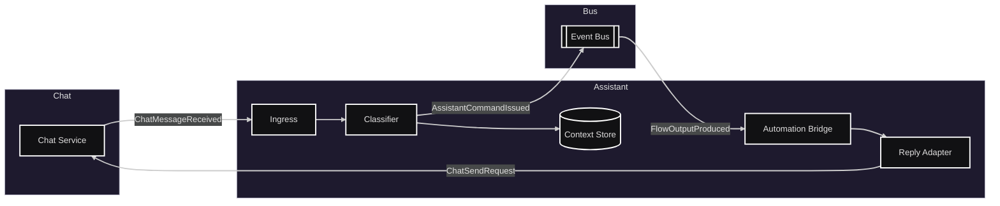

# Módulo: Asistente

## Diagrama arquitectura

---

## Requerimientos

- Clasificar intención/entidades de mensajes entrantes del chat (NLU/reglas y fallback).
- Mantener contexto corto por chat/sesión (últimos mensajes, slots, preferencias básicas) con expiración.
- Desacoplar la ejecución: emitir eventos para que Automatización ejecute acciones.
- Publicar respuestas al chat a partir de salidas producidas por Automatización.
- Integrarse con Auth: validar `user_id`/`campus` provenientes del Chat (JWT) para auditar y aplicar políticas.
- Idempotencia por `message_id` y trazabilidad con `chat_id`/`flow_run_id`.

---

## Listado de puntos de comunicación

### Eventos (Pub/Sub)

- Ingestar mensajes entrantes desde Chat: `ChatMessageReceived` (desde Chat Service) — entrada principal al Asistente.
- Disparar flujos por intención del asistente: `AssistantCommandIssued` (desde Asistente) — trigger por `intent` y `entities`.
- Solicitar publicación de respuesta en Chat: `ChatSendRequest` (desde Asistente) — salida hacia el canal de Chat.
- Emitir resultados de Automatización para el Asistente: `FlowOutputProduced` (desde Automatización) — salida renderizable por Chat.
