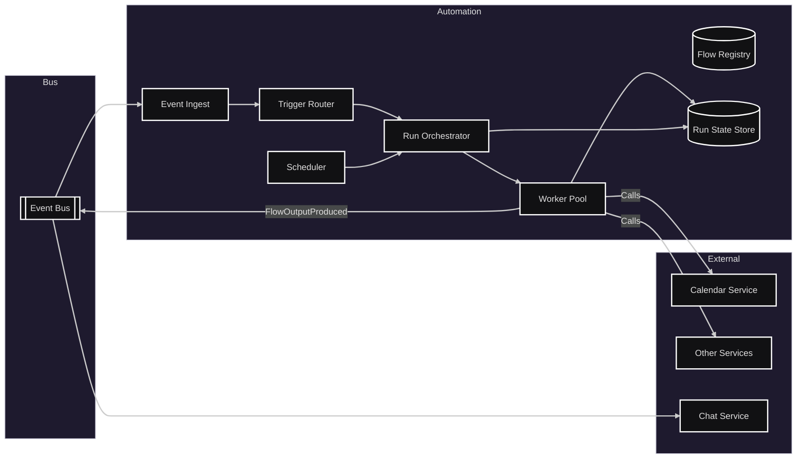
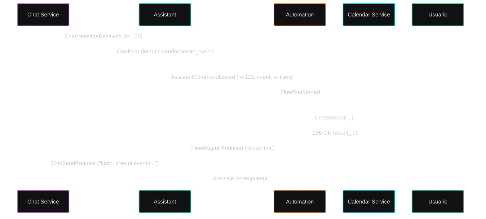

# Módulo: Automatización

## Diagrama arquitectura

---

## Requerimientos

- Registrar y versionar definiciones de flujos (triggers, condiciones, pasos, plantillas de salida).
- Disparar flujos por eventos (p. ej., `AssistantCommandIssued`), por cron y por API manual.
- Orquestar pasos con reintentos exponenciales, idempotencia por `step_id`, y compensaciones opcionales.
- Mantener estado de ejecución consultable (`flow_run_id`, historial de steps, errores, tiempos).
- Integrarse con servicios internos (Calendar, Discovery, Avisos) y producir salidas para Asistente/Chat.
- Seguridad: ejecutar “en nombre de” del usuario cuando aplique (delegación/OBO) o con credenciales de servicio.

---

## Secuencia típica (mensaje → evento de calendario → respuesta)

---

## Listado de puntos de comunicación

### Eventos (Pub/Sub)

- Disparar flujos por intención del asistente: `AssistantCommandIssued` (desde Asistente) — trigger por `intent`.
- Ejecutar trabajos programados: Cron del Scheduler (interno) → `FlowRunStarted`.
- Emitir resultados para el Asistente: `FlowOutputProduced` (payload renderizable por Chat).
- Integración con Calendar (ver módulo Calendar):
  - Comandos: `CalendarCommand.ScheduleEvent`, `CalendarCommand.UpdateEvent`, `CalendarCommand.CancelEvent`.
  - Eventos: `CalendarEvent.Created`, `CalendarEvent.Updated`, `CalendarEvent.Canceled`, `CalendarEvent.CreateFailed`.
- Integración con Discovery (ver módulo Discovery):
  - Paso invoca Search API/BFF sincrónicamente; opcionalmente se cachea el topN.

### HTTP/RPC (sincrónico)

- `POST /automation/flows` — registrar/actualizar definición de flujo (admin).
- `GET /automation/flows/{id}` — obtener definición de flujo.
- `POST /automation/flows/{id}/run` — disparar manualmente un flujo (debug/manual).
- `GET /automation/runs/{runId}` — estado de ejecución.
