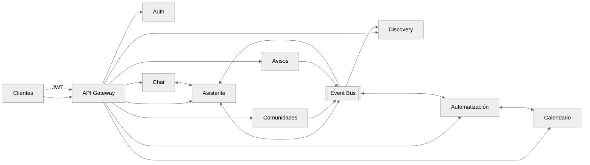
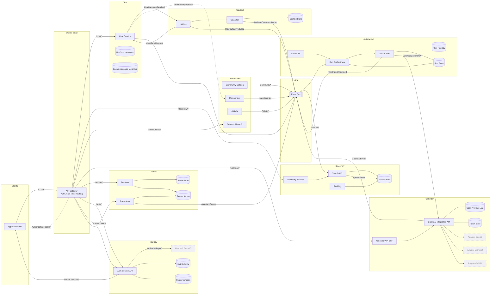

# Tarea Unidad 3 - Arquitectura de Software
## Descripción del problema
Se requiere implementar un sistema que permita el desarrollo de la comunidad universitaria a través de la **generación de grupos de mensajería**, una **aplicación de chat**.

## Contexto de negocio
- **Asistente de chat:** Chat personal, en el cual se podrán consultar preguntas frecuentes relacionadas a trámites, eventos, y tópicos relacionados con la universidad.
- **Añadir, modificar, recordatorios y eventos de calendario:** Se contará con un calendario académico, el cual contará con las fechas importantes de la institución pero también permite la manipulación del estudiante.
- **Canales de difusión:**
  - **Canales temáticos** que permitirán conectar estudiantes relacionados al tópico.
  - **Avisos:** Difusión masiva de manera nativa, con alcance variable según privilegios.
  - **Grupos oficiales:** Encuentra grupos oficiales de ramos y carreras creados por autoridades.
  - **Descubrimiento de comunidades:** Encuentra grupos y comunidades dentro de la universidad más allá de grupos de los oficiales.

## Lenguaje ubicuo
- **Estudiante:** Persona inscrita en algún plan de estudios de la universidad.
- **Profesores:** Persona que imparte clases en la universidad.
- **Centro de alumnos:** Estudiantes de la universidad que son parte del centro de alumnos vigente.
- **Federación estudiantil:** Organización de estudiantes que son parte de la federación del campus respectivo.
- **Campus:** Sede a la que pertenece el estudiante, centro de alumnos y federación estudiantil. Los profesores podrían llegar a ser parte de dos campus.
- **Carrera:** Plan de estudios en el que son parte Estudiantes y Profesores.
- **Curso:** Asignatura que se imparte en la universidad.
- **Administrativo:** Persona que trabaja en la universidad en labores administrativas.
- **Comunidad:** Grupo de estudiantes que siguen una temática en común.
- **Curso:** Asignatura que se imparte en la universidad.
- **Aviso:** Mensaje de difusión emitido por una sola autoridad a un grupo de estudiantes.
- **Afinidad:** Grado de coincidencia entre intereses.
- **Faceta:** Conteo por atributo para filtrar resultados (tag, campus, visibilidad).

## Módulos

- [Autenticación de usuario](./Auth.md)
- [Descubrimiento de comunidades](./Discovery.md)
- [Comunidades](./Comunidades.md)
- [Calendario (Externo)](./Calendar.md)
- [Asistente](./Asistente.md)
- [Automatización](./Automatización.md)
- [Chat](./Chat.md)
- [Avisos](./Avisos.md)
## Diagrama de arquitectura general

### Vista rápida

> [!NOTE]
> Para ver cada módulo en detalle, revisa su documento específico. [aquí](#módulos)

---

### Diagrama "casi" completo

> [!NOTE]
> El diagrama muestra flujos principales entre módulos: Auth, Chat, Asistente, Automatización, Calendario, Comunidades, Descubrimiento y Avisos, junto al Event Bus y el API Gateway.
> Componentes externos (IdP y proveedores de calendario) se marcan como fuera de alcance.
