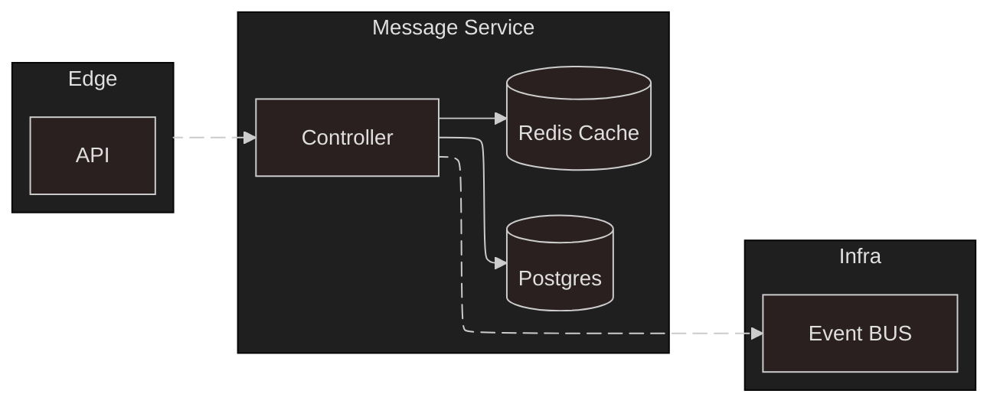

# Proyecto Arquitectura de Software

## Microservicio: [Mensajes](https://github.com/KroderDev/INF326-tarea-2/blob/4b0a2607ba41b16b66e1b98ac9284e55ed72682f/.docs/message.svg)

### Flujo del microservicio

> [!NOTE]
> En el caso del almacenamiento de los chats se opto por lo siguiente: Se mantiene una tabla con todos los mensajes existentes, indexando por hilo para que se agrupen y favorecer la eficiencia de las consultas (Base de datos relacional). A su vez con el fin de agilizar las consultas de mensajes tendremos una BD en memoria, lo cual reducira el tiempo en consultas a chats de alto flujo y optimizara el uso de la base de datos principal. Mencionar que el flujo mencionado sera gestionado por el controlador.

---

### API

- POST `/threads/{thread_id}/messages`
  - Header: `X-User-Id: <uuid>` (obligatorio)
  - Body: `{ "content": str, "type": "text|audio|file"?, "paths": string[]? }`
  - Respuestas: `201` con el mensaje creado; `400` si header inválido; `500` en error interno.

- PUT `/threads/{thread_id}/messages/{message_id}`
  - Header: `X-User-Id: <uuid>` (obligatorio)
  - Body: `{ "content"?: str, "paths"?: string[] }`
  - Respuestas: `200` con el mensaje; `404` si no existe; `400/500` según error.

- DELETE `/threads/{thread_id}/messages/{message_id}`
  - Header: `X-User-Id: <uuid>` (obligatorio)
  - Respuestas: `204` al eliminar; `404` si no existe; `400/500` según error.

- GET `/threads/{thread_id}/messages?limit=50&cursor=<created_at|id>`
  - Query: `limit` (1..200), `cursor` opcional para paginar por keyset. Si no se envía `cursor`, devuelve los más recientes.
  - Respuestas: `200` con `{ items: Message[], next_cursor: string|null, has_more: boolean }`; `500` en error interno.
---

### Eventos

- Nuevo mensaje: Encola en el contenedor de RabbitMQ, emula el funcionamiento del event bus, el mensaje completo en formato JSON. Se agregan todos los elementos a una cola llamada: `messages_service`, la cual no considera tipicos en sus componenetes. Por lo que a modo grafico queda lo siguiente en la cola `messages_service`: _{ topic:""; data: message}_

---

### Arranque con Docker Compose

- `make compose` o `docker compose up -d --build` crea la base de datos si no existe y aplica las migraciones antes de iniciar la API.
- Servicio `db-init` asegura la creación de `messages_service` incluso si el volumen ya existía.
- Servicio `migrate` aplica las migraciones y la API espera a que termine exitosamente.

[Video demostrativo](https://github.com/user-attachments/assets/f8fb30be-6f26-442f-b3a2-591879852cf2)

