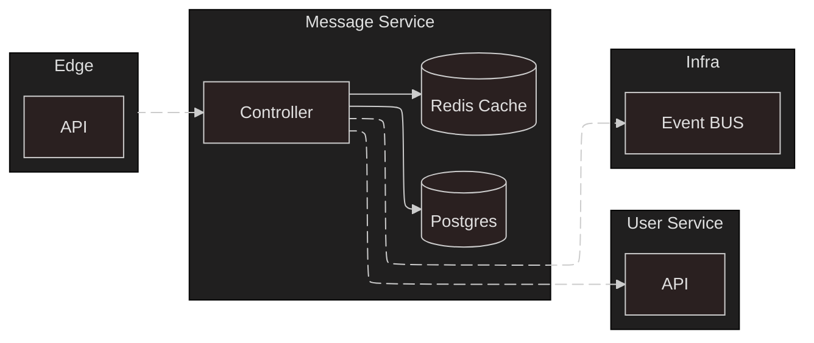

# Proyecto Arquitectura de Software

## Microservicio: Mensajes

### Flujo del microservicio

---

### API

**POST _/message/{thread_id}/{user_id}/{content}_**
- thread_id: identificador unico del hilo.
- user_id: identificador unico del usuario que registra el mensaje.
- content: Contenido a insertar dentro del mensaje.
- typeM_(Se pasa como opcional)_: Lista con los tipos de mensajes que tiene (archivo, mensaje de voz, etc.).
- path_(Se pasa como opcional)_: Lista con las rutas de todos los archivos insertados en el mensaje.
>Ej de llamada:
    POST /message/1/42?typeM=text?path=dir/archivo_texto

**PUT _/message/{thread_id}/{message_id}/{user_id}/{content}_**
- thread_id: identificador unico del hilo.
- user_id: identificador unico del usuario que registra el mensaje.
- message_id: identificador unico del mensaje a modificar.
- content: Contenido a insertar dentro del mensaje.
- typeM_(Se pasa como opcional)_: Lista con los tipos de mensajes que tiene (archivo, mensaje de voz, etc.).
- path_(Se pasa como opcional)_: Lista con las rutas de todos los archivos insertados en el mensaje.
>Ej de llamada:
    PUT /message/1/5/42?typeM=text?path=dir/archivo_texto

**DELETE _/message/{thread_id}/{message_id}/{user_id}_**
- thread_id: identificador unico del hilo.
- user_id: identificador unico del usuario que registra el mensaje.
- message_id: identificador unico del mensaje a modificar.
>Ej de llamada:
    DELETE /message/1/5/42

**GET _/message/{thread_id}_**
- thread_id: identificador unico del hilo.
- typeM_(Se pasa como opcional)_: Valor del tipo del filtrado, -1 segun fecha y 1 segun cantidad de mensajes.
- filtro_(Se pasa como opcional)_: Valor donde realiza el corte la obtencion, podrian ser X mensajes o desde Y fecha.
>Ej de llamada:
    GET /message/1/?typeM=1?filtro=18-01-2025
---

### Eventos

Nuevo mensaje

---

